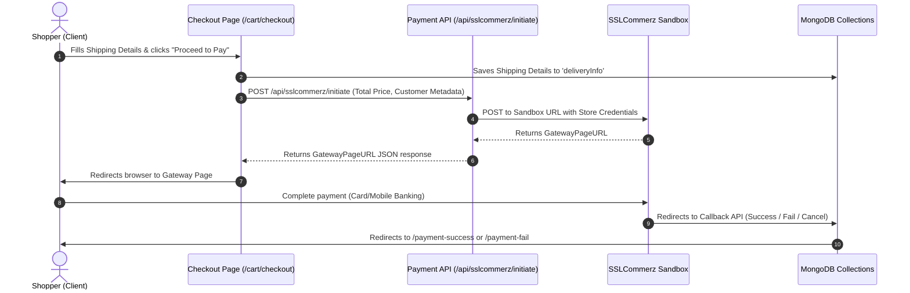

# 💳 AgriTech – Payment System & Flow Documentation

This document describes the payment architecture, checkout workflows, API routes, database hooks, and configuration setup for **AgriTech**.

---

## 🗺️ 1. Payment Flow Overview

AgriTech integrates **SSLCommerz** (a popular Bangladeshi payment gateway) as the main checkout portal, alongside placeholder routing for **Stripe** payments.



---

## ⚙️ 2. API Endpoint Specifications

### 🛫 Payment Initiation (`/api/sslcommerz/initiate`)
*   **Method**: `POST`
*   **Payload Request**:
    ```json
    {
      "amount": 1500,
      "fullName": "Imtiaz Ahmad",
      "phoneNumber": "01712345678",
      "userEmail": "customer@gmail.com"
    }
    ```
*   **Action**: Initializes a session with SSLCommerz sandbox server and issues a redirect transaction token.

### 🛬 Callback Endpoints (`/api/sslcommerz/...`)

*   **Success Route (`/api/sslcommerz/success`)**:
    *   **Action**: Trigged by gateway upon successful card charge.
    *   **Database Operations**:
        1. Creates an order entry in the `orders` collection (`paymentStatus: "Paid"`).
        2. Empties the shopper's active selection in the `carts` collection.
    *   **Redirect**: Sends the client to `/payment-success`.
*   **Fail Route (`/api/sslcommerz/fail`)**:
    *   **Action**: Trigged on failed transactions.
    *   **Redirect**: Sends the client to `/payment-fail`.
*   **Cancel Route (`/api/sslcommerz/cancel`)**:
    *   **Action**: Triggered when the customer cancels payment.
    *   **Redirect**: Sends the client to `/payment-cancel`.

---

## 💾 3. Database Records (Post-Payment)

Upon a successful transaction, a new document is inserted into the `orders` collection:

```json
{
  "_id": "ObjectId",
  "userEmail": "customer@gmail.com",
  "vendorEmail": "grower@greengrow.com",
  "items": [
    {
      "productId": "651a2b3c4d5e6f7g8h9i0j1k",
      "productName": "Organic Heirloom Tomato",
      "unit": "kg",
      "quantity": 2,
      "price": 150,
      "photoUrl": "https://images.unsplash.com/..."
    }
  ],
  "totalPrice": 400, // (Subtotal: 300 + Shipping Fee: 100)
  "shippingAddress": {
    "fullName": "Buyer Name",
    "phoneNumber": "01712345678",
    "address": "Road 4, House 12",
    "city": "Dhaka",
    "region": "Dhaka Division"
  },
  "paymentStatus": "Paid",
  "orderStatus": "Processing",
  "transactionId": "sslc_trans_87gsa9",
  "orderedAt": "2026-07-02T10:00:00Z"
}
```

---

## ❌ 4. Current Limitations & Action Items

### 🔒 Hardcoded Keys in SSLCommerz
*   **Issue**: In `src/app/api/sslcommerz/initiate/route.ts`, the keys `store_id` and `store_passwd` are hardcoded strings inside the request payload body instead of pulling dynamically from environment variables.
*   **Resolution**: Replace them with `process.env.SSLCOMMERZ_STORE_ID` and `process.env.SSLCOMMERZ_STORE_PASSWORD`.

### 🧩 Commented-out Stripe Checkout
*   **Issue**: The `/checkout` route (Stripe) is commented out with a warning that the checkout is unavailable.
*   **Resolution**: Set up the Stripe SDK, retrieve secret payment intent client tokens in `/api/create-payment-intent`, and load `<Elements>` with a valid publishing key.

---

## 🛠️ 5. Setting Up Keys in `.env.local`

To run payment gateways securely, add the following variables:

```env
# SSLCommerz Configuration
SSLCOMMERZ_STORE_ID=your_store_id
SSLCOMMERZ_STORE_PASSWORD=your_store_password
NEXT_PUBLIC_BASE_URL=http://localhost:3000

# Stripe Configuration
NEXT_PUBLIC_STRIPE_PUBLISHABLE_KEY=pk_test_...
STRIPE_SECRET_KEY=sk_test_...
```
